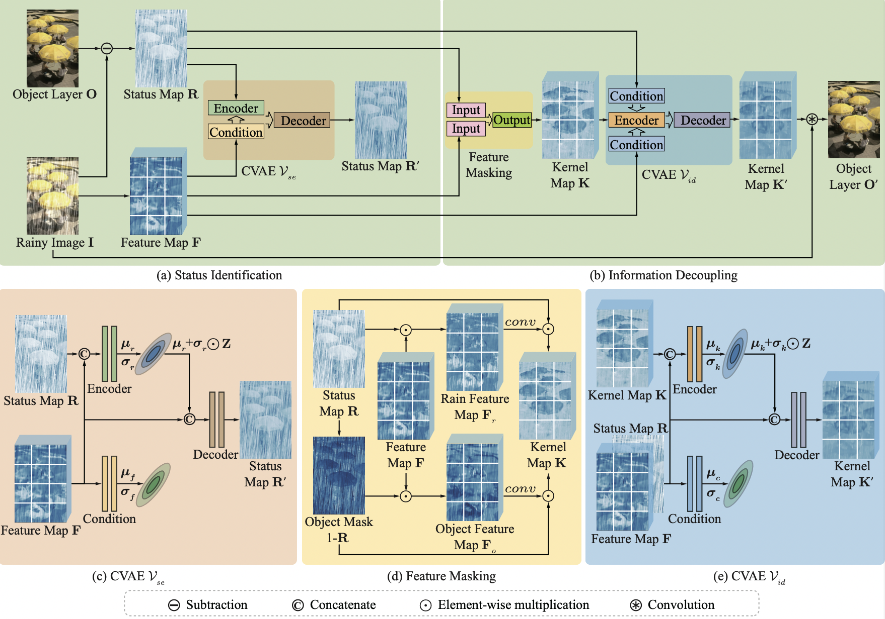
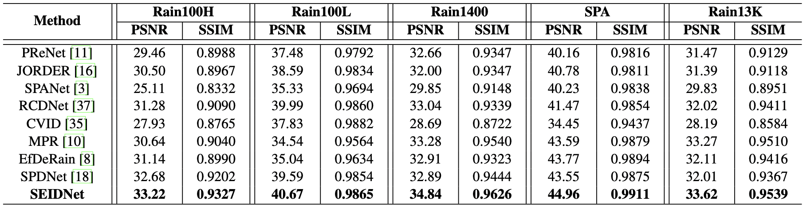
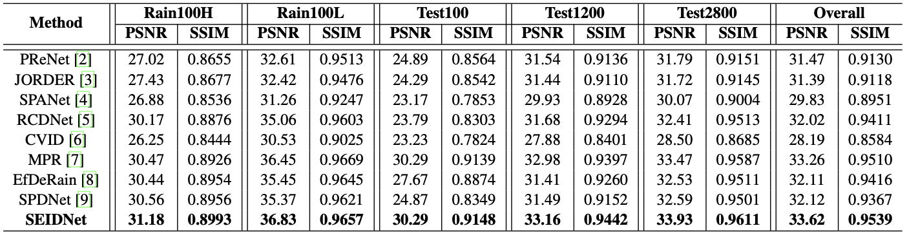
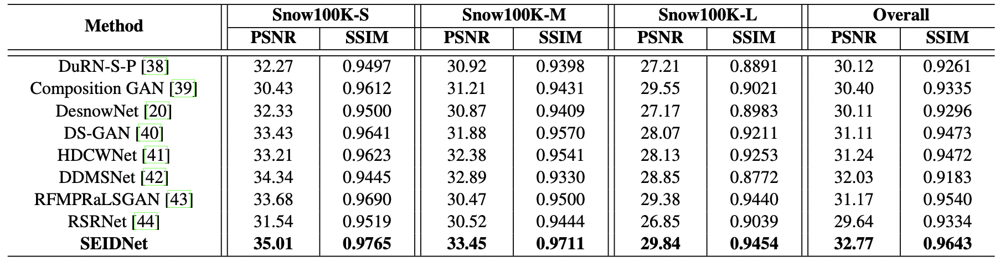
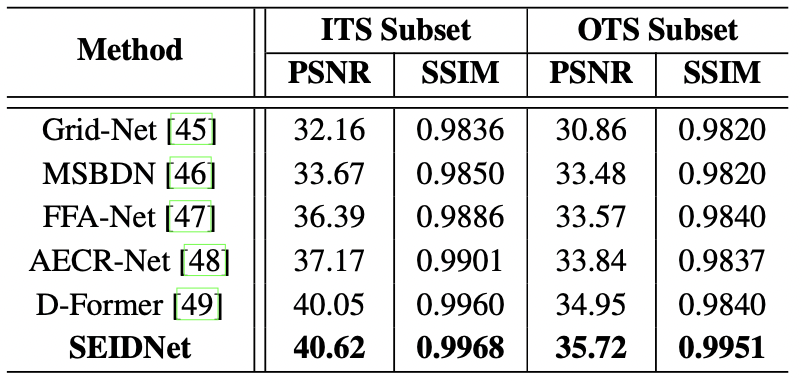
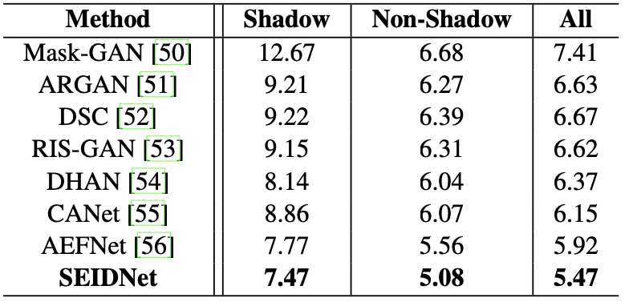

# SEIDNet
we propose SEIDNet equipped with the generative Status Estimation and Information Decoupling for rain removal.



## Requirements

- python 3.7.11
- pytorch 1.8.0
- CUDA Version 11.4
- opencv-python 4.4.0.44
- scikit-image 0.17.2

## Datasets
Single image rain removal
- Rain100L-old_version https://github.com/nnUyi/DerainZoo/blob/master/DerainDatasets.md
- Rain100H-old_version https://github.com/nnUyi/DerainZoo/blob/master/DerainDatasets.md
- Rain1400 https://xueyangfu.github.io/projects/cvpr2017.html
- SPA https://stevewongv.github.io/derain-project.html
- Rain13k https://github.com/swz30/MPRNet

Single image snow removal
- Snow100K https://goo.gl/BrRc3U

Single image haze removal
- ITS&OTS https://sites.google.com/site/boyilics/website-builder/reside

Single image shadow removal
- ISTD Dataset https://drive.google.com/file/d/1I0qw-65KBA6np8vIZzO6oeiOvcDBttAY/view


## Pretrained models

Coming soon

## Train

```
sh train_SEIDNet.sh
```

## Test

```
sh test_SEIDNet.sh
```

## Results

<details><summary>Single image rain removal</summary>
<p>
We compare SEIDNet with state-of-the-art methods on the test sets of Rain100H, Rain100L, Rain1400, SPA and Rain13K. The performances are reported in terms of PSNR and SSIM.


We compare SEIDNet with state-of-the-art methods on the test sets of Rain13K. The performances are reported in terms of PSNR and SSIM.

</p>
</details>


<details><summary>Single image snow removal</summary>
<p>
We compare SEIDNet with state-of-the-art methods on the test sets of Snow100K. The performances are reported in terms of PSNR and SSIM.

</p>
</details>

<details><summary>Single image haze removal</summary>
<p>
We compare SEIDNet with other methods on ITS&OTS. The results are listed in terms of PSNR and SSIM.

</p>
</details>

<details><summary>Single image shadow removal</summary>
<p>
We compare SEIDNet with other methods on the test set of ISTD. The per- formances are reported in term of RMSE.

</p>
</details>


## Bibtex


